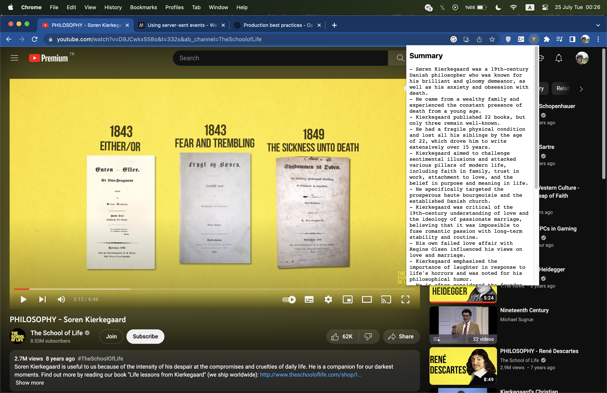
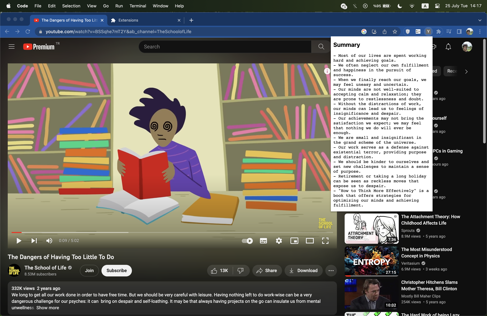

# YouTube Video Summarizer Extension

This Chrome extension is designed to provide a summary of YouTube videos in text format. It's a helpful tool for viewers who want to get an overview of a video before deciding to watch it in full. The extension fetches captions from the video, sends them to an AI model, and displays a summarized version of the content in a convenient popup. 

## Features

- Fetches captions from YouTube videos automatically based on the current tab's URL
- Summarizes the video content using OpenAI's GPT-3 model
- Displays the summary in a popup when the extension icon is clicked

## Installation

1. Download or clone this repository to your local machine.
2. Open Chrome and navigate to `chrome://extensions`.
3. Enable Developer mode by clicking the toggle switch at the top right.
4. Click the `Load unpacked` button and select the directory containing your extension.
5. The extension should now be visible in your extensions list, and an icon for it should appear in the toolbar.

## Usage

Navigate to any YouTube video and click the extension icon in your toolbar. The extension will fetch and display a summary of the video's content.

## Screenshots

## Support

If you encounter any issues or have any feature suggestions, please [create an issue](https://github.com/reigon/YoutubeExtension/issues) in this repository.

## License

This project is under no license. 
